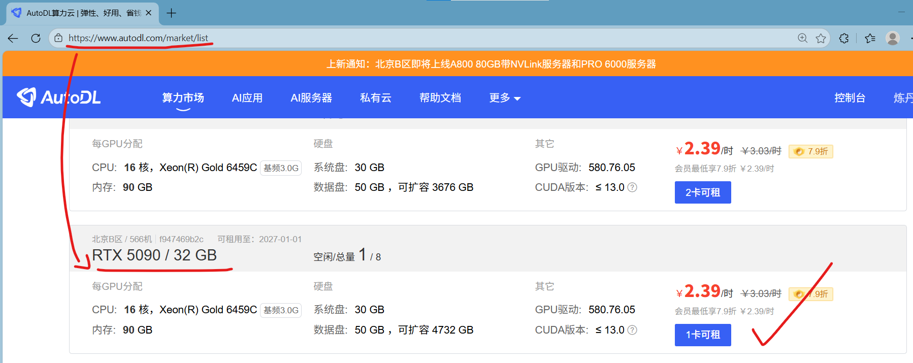
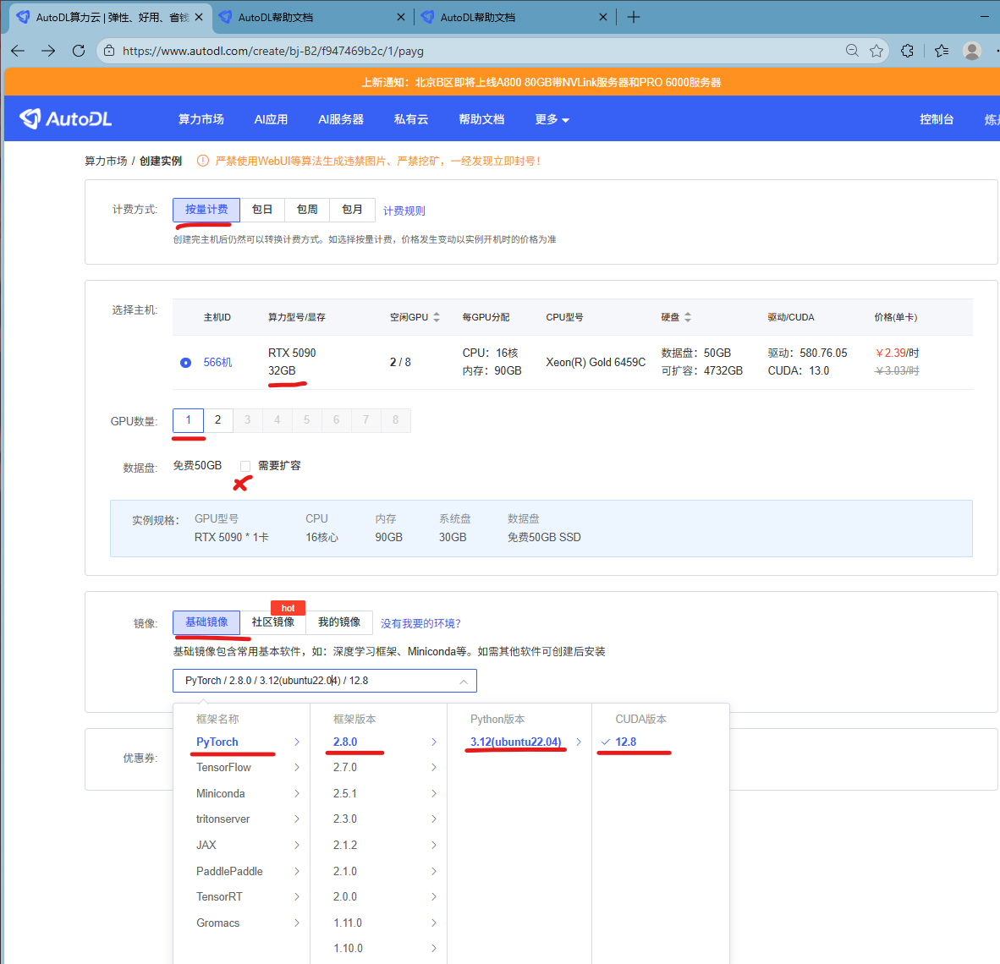
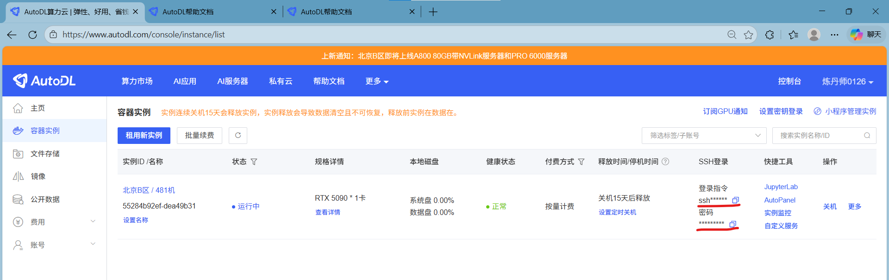
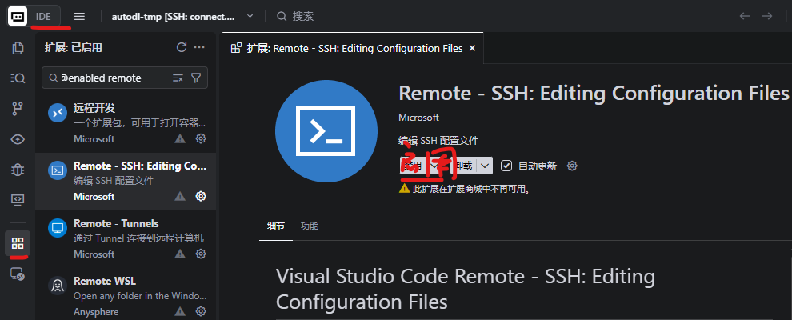
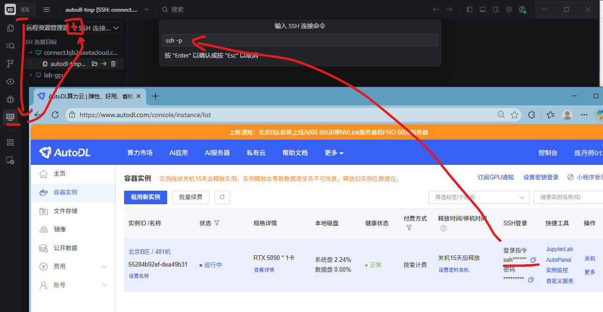
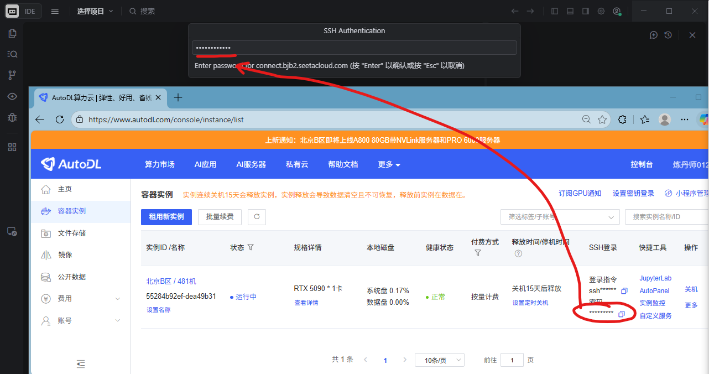
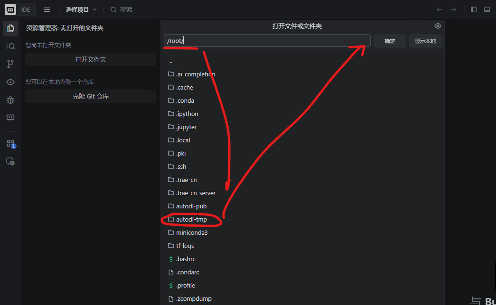

## Kernel Bench 实验指导手册

[TOC]

### 租服务器







### 远程登录服务器









### 下载Kernel Bench GitHub仓库

先给联网加个速[只在当前端口生效] [服务器不方便配置代理]

```shell
source /etc/network_turbo
```

```shell
git clone https://github.com/HaiPenglai/KernelBench-GuideBook
```

