## Kernel Bench 实验指导手册

[TOC]

### 租服务器


### 远程登录服务器


### 网络加速

AutoDL 务必开启学术加速，否则下载库会非常慢。
```shell
source /etc/network_turbo
```

### 下载仓库

建议在 `autodl-tmp`（数据盘）目录下操作，防止根目录空间不足。
```shell
cd /root/autodl-tmp
git clone https://github.com/ScalingIntelligence/KernelBench
```

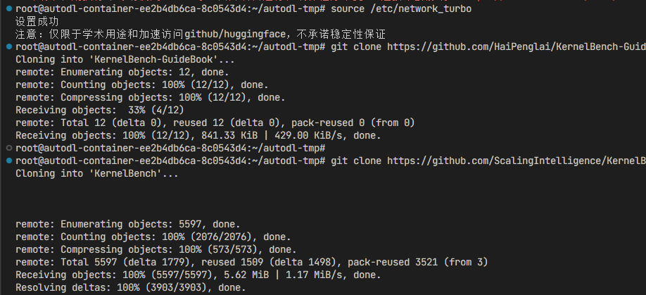

### 看一下它的题目（PyTorch）是如何设计的？

```shell
KernelBench/KernelBench/level1/1_Square_matrix_multiplication_.py
```

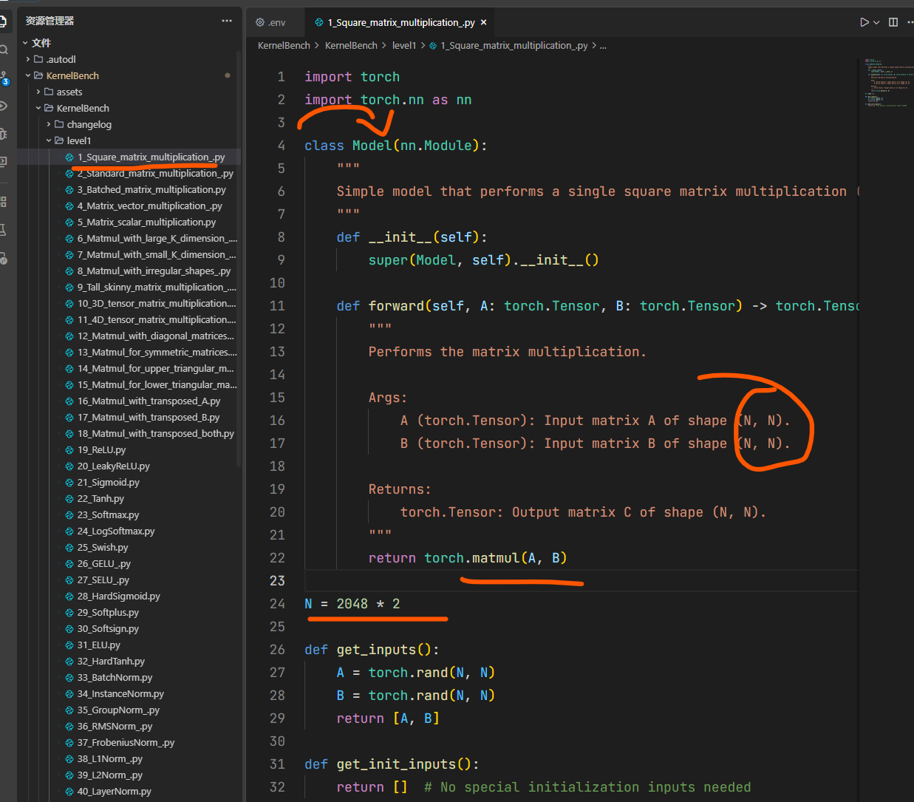

### 看看提示词是怎么写的？

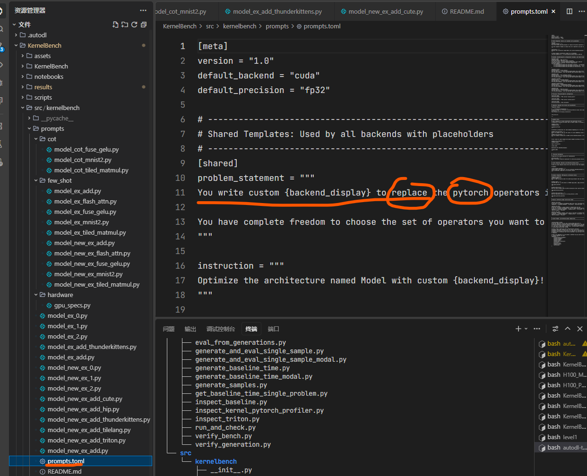


### 看看模型写的答案（CUDA）是什么样的？

提示这一步需要等生成完毕之后才可以查看，一开始是没有这个答案的。

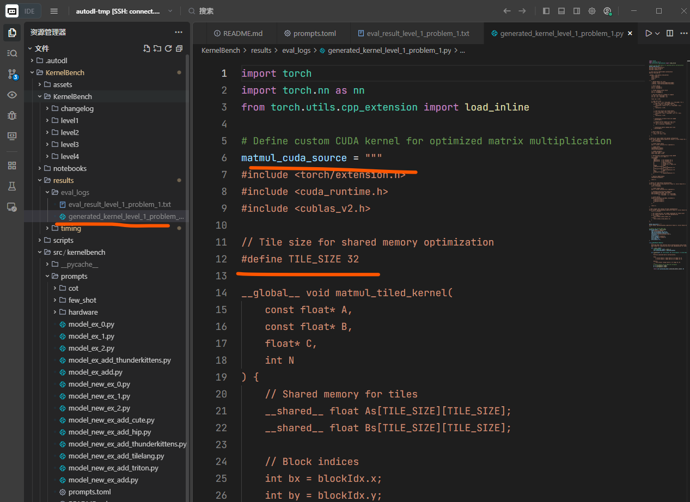

### 一键安装没有装的包

我通过使用`pip list`指令和`requirements.txt`对比了一下，在这个预装环境上，还有这些包没有安装：

```shell
# 1. 开启学术加速
source /etc/network_turbo

# 2. 增量安装缺失依赖（已剔除预装包，确保驱动稳定性）
pip install \
  litellm[proxy] openai transformers datasets \
  python-dotenv einops tabulate pydra-config tomli ninja \
  nvidia-cutlass-dsl tilelang \
  modal

# 3. 配置项目路径（执行评测前必须执行）
export PYTHONPATH=$PYTHONPATH:$(pwd)/src
```

这里特别要注意一个点，就是我们之前因为已经执行了学术加速，就不用再使用清华源了，我试了一下，用清华源还没有直接下载快。

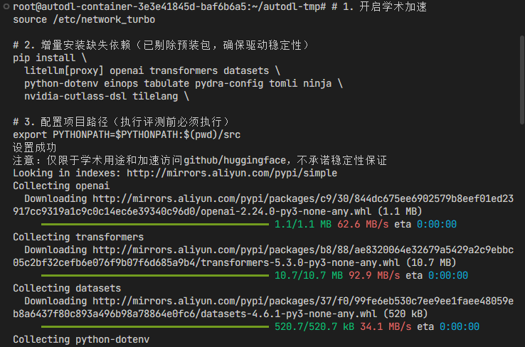

安装成功之后可能会提示一下，没有创建虚拟环境，不过我们临时使用服务器的话，完全不需要去创建它。

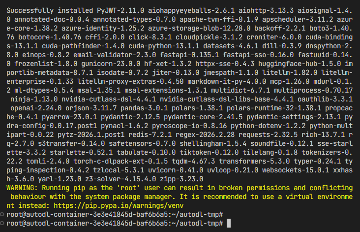

### 测试5090基准性能

因为不同的硬件平台的性能肯定是不一样的，我们不可能拿5090跑得的结果和H100比，所以需要先用5090把Torch.Eager模式的算子基准性能跑出来。之后再跑出来一个大模型写的算子的性能，两者才能进行对比。

但是作者提供了两种方式，一种方式是先把基准的算子全部跑出来，形成一个性能记录文件，然后再去跑大模型写的算子。还有一种方式是，边跑边对比，就是每次去跑这个ai生成的算子，现场再去测一把pytroch的算子。

如果要采取第1种方法，就是先把基准算子的性能跑出来，可以执行下面的操作。

```shell
# 1. 给 Python 指路. 这是因为代码中引用了src，
export PYTHONPATH=$PYTHONPATH:$(pwd)/src

# 2. 尝试跑一下 5090 的基准性能（这步不需要 API，注意需要在根目录执行）
python scripts/generate_baseline_time.py --level 1 --num_problems 1
```

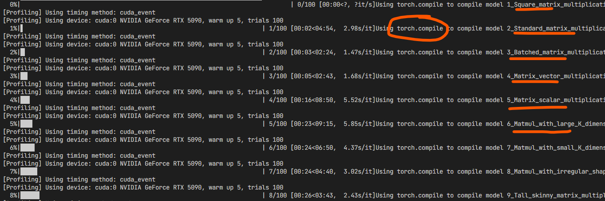

这个时间会稍微有点久，可能要跑一个小时左右，因为他要用Torch的Eager和compile模式各自跑一遍，这个和我们之前读的这个论文是一致的，而且每一个level会跑一遍，然后比如说level-1有100个算子，它就会执行一遍，然后Level3有50个算子，它会再执行一 遍。

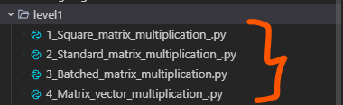

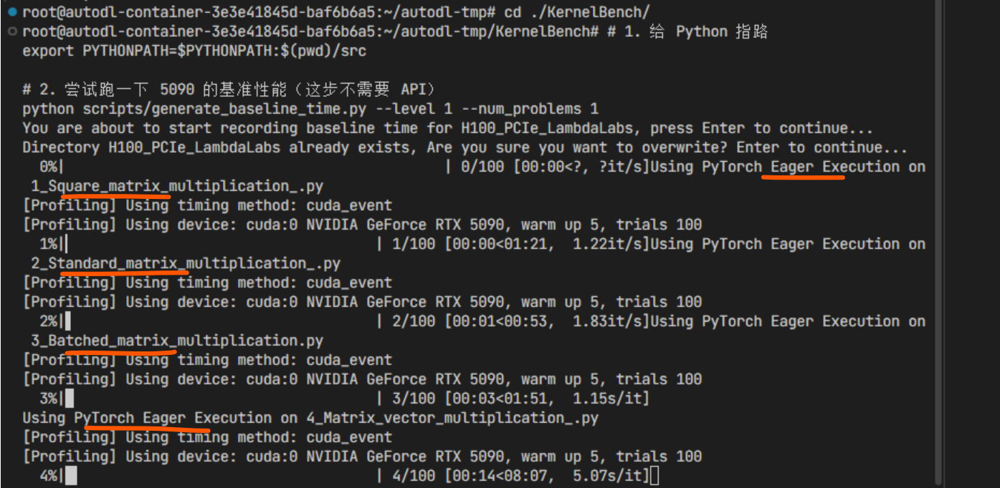

### 查看生成的性能日志

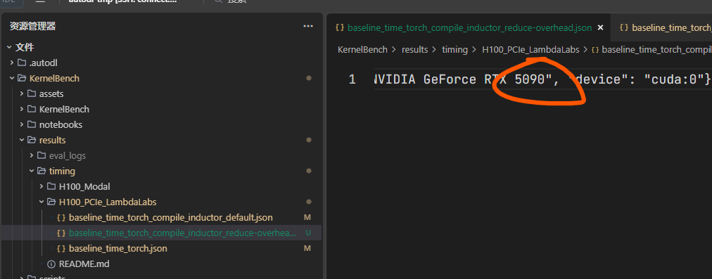

可以看到，在results的timing当中生成了一个5090的日志。

### 准备API

在这个项目当中，他准备了一个调用api的接口，其中就有openai、claude、Gemini、deepseek的，但是没有open router的，为了防止可能的麻烦，我们就用deepseek的。

我去deep seek的官网充值了一小点钱，然后创建了API（仅在演示期间有效）。

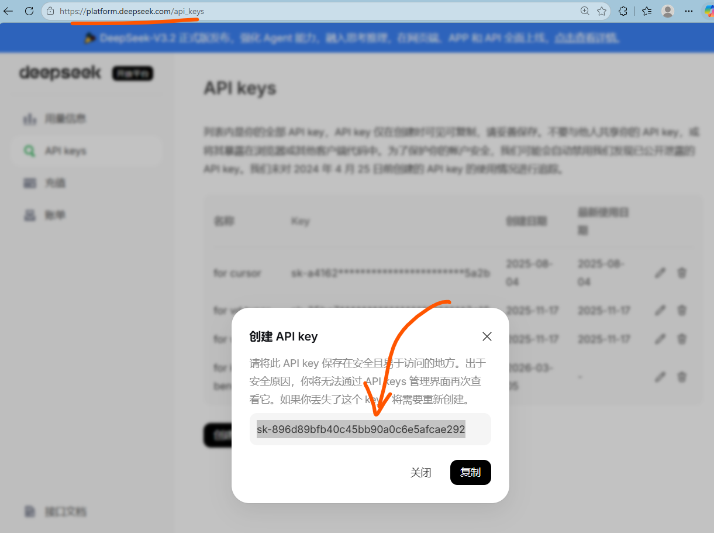

### 配置API-KEY

首先需要把之前的这个api key复制进去，可以看到作者在根目录已经创建了一个例子，但是他的意思是我们还是要自己去创建一个.env文件，然后把我们的api key复制进去。

注意：作者的API-key在这里只是一个例子，还是需要我们自己写一个.env。

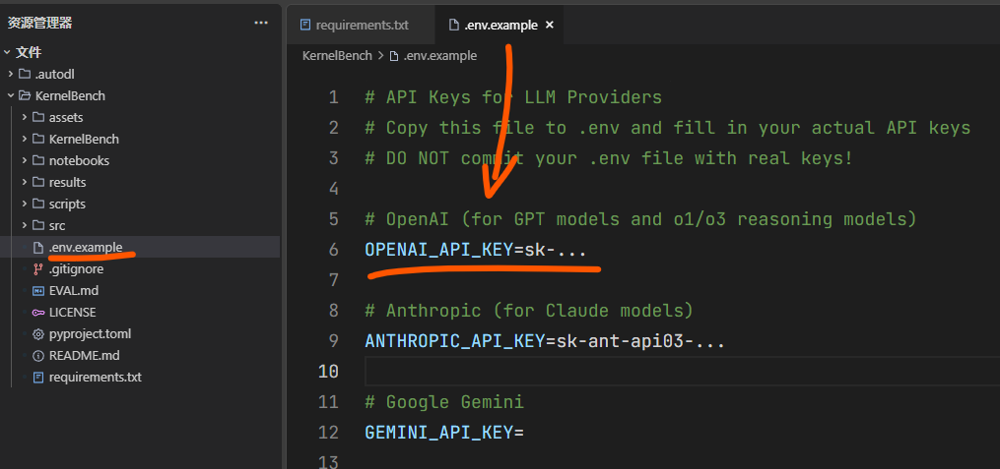

我们自己的.env

```shell
cd /root/autodl-tmp/KernelBench

# 写入原生 DeepSeek 配置
cat <<EOF > .env
DEEPSEEK_API_KEY=sk-896d89bfb40c45bb90a0c6e5afcae292
EOF
```

### 实时测试

要把所有的算子测试完，是需要花一点时间的，所以在演示的时候呢，我们就进行实时测试，就是大模型算子生成，一边测大模型的，一边去测基准算子。简单起见，测单个算子的效果。

```shell
# 1. 开启学术加速 (为了让脚本能连上 HuggingFace 检查数据集)
source /etc/network_turbo

# 2. 关键：告诉系统，访问 DeepSeek 的 API 不要走代理（国内直连）
export no_proxy="api.deepseek.com"

# 3. 给 Python 指路
export PYTHONPATH=$PYTHONPATH:$(pwd)/src

# 4. 运行命令 (重点：模型名前面加上 deepseek/ 前缀)
python scripts/generate_and_eval_single_sample.py \
  dataset_src=huggingface \
  level=1 \
  problem_id=1 \
  server_type=deepseek \
  model_name=deepseek/deepseek-chat \
  temperature=0 \
  log=True \
  log_generated_kernel=True
```

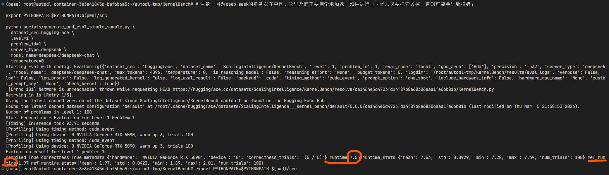

可以看到，这个算子的运行时间是7.53，参考算子的运行时间是1.97也就是说它变慢了，不过这个无所谓了，我们只要把跑通一个就可以了。
